# Species Classification with Active Learning
Camera traps are gaining popularity as a tool for conducting widespread and long-term biodiversity surveys. These are motion-activated cameras that take a burst of photos like the following from the Missouri Camera Traps Dataset1.

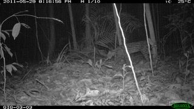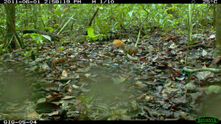

## Getting Only Images with Animals
Conservation researchers often want to use these data to answer questions about the abundance or characteristics of the animals detected in the images. To do this, it would be helpful to first discard empty images. For example, a red fox appears in only the first frame of this image sequence:

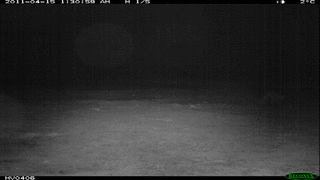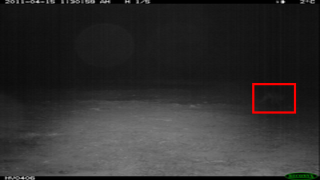

This first step can be handled reasonably well by first applying an object detector to the camera trap data. We can use the predicted bounding boxes to crop the camera trap images around detected animals.

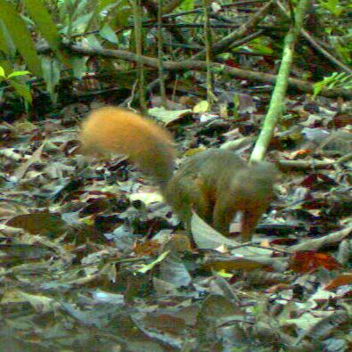
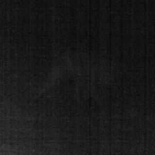

## Identifying Species in the Dataset

Next, it would be useful to group all animal detections by species. To do this, we will train a species classifier customized to the species present in the dataset, with the help of a human expert who can label species. We display cropped images in an interface with a dropdown menu for assigning labels for selected images:

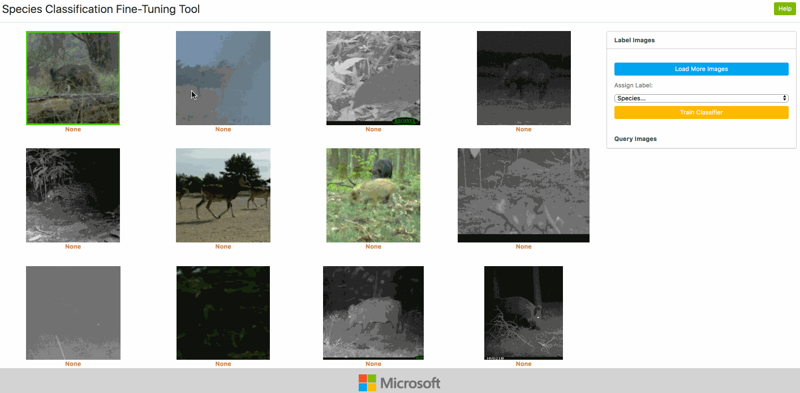

Users can also view the full image corresponding to a cropped image, and the image sequence from the burst:

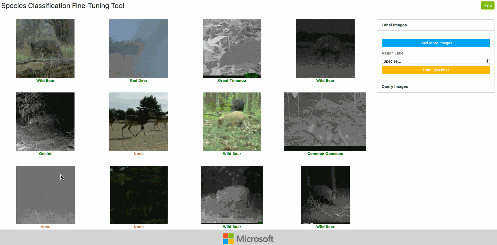

After labeling some images, the user can train a classifier using the labels they have provided so far. Then, the classifier makes predictions about the classes for remaining images, which appear under the crops when more are loaded.

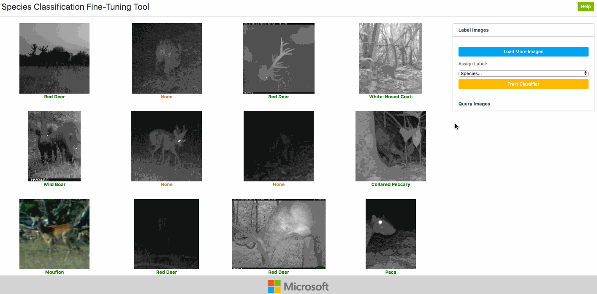

The user can ask to view images the classifier assigns a specific label, confirm images that are correctly labeled, and correct any that are mislabeled:

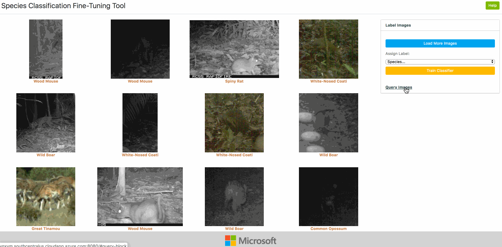

After a few iterations of labeling and training, the classifier already begins to make much better predictions:

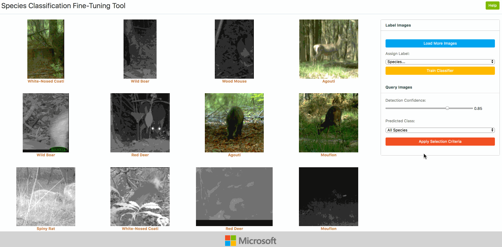

1 Zhang, Z., He, Z., Cao, G., & Cao, W. (2016). Animal detection from highly cluttered natural scenes using spatiotemporal object region proposals and patch verification. IEEE Transactions on Multimedia, 18(10), 2079-2092.